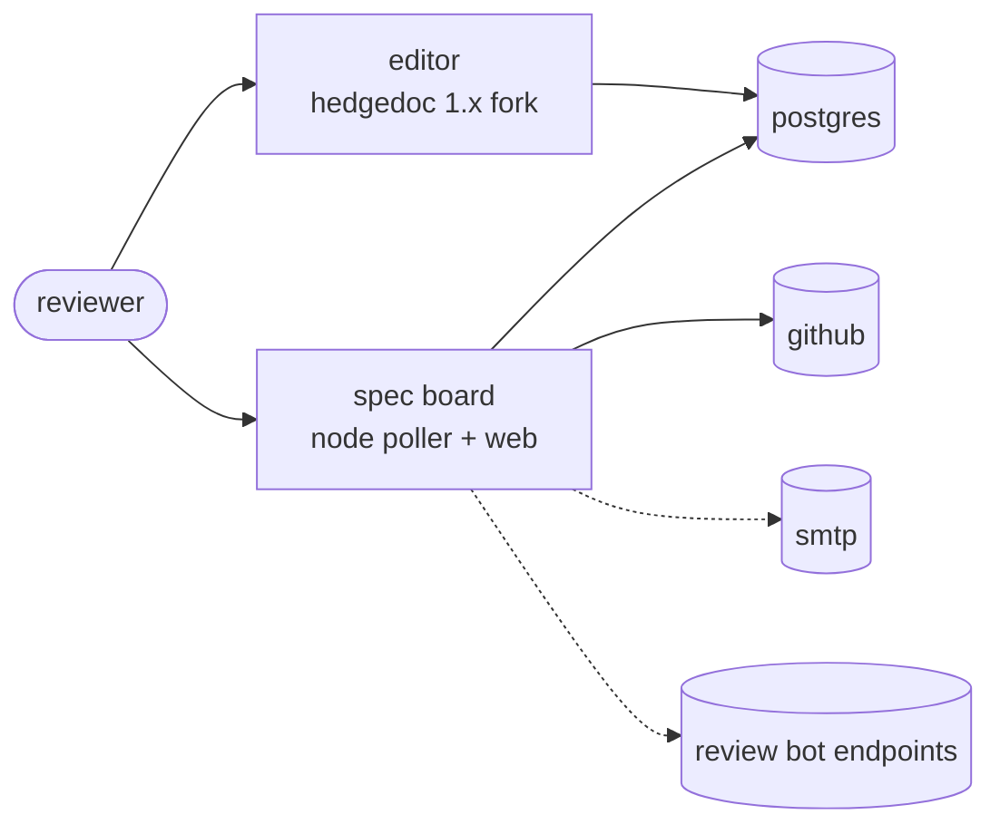

# architecture

two services and one postgres.

## editor

hedgedoc 1.x plus criticmarkup review: inline comment threads, suggestions with
accept/reject, approvals in the navbar, a `/new/spec` template, deep links to
threads. the rebrand is applied at image build time, so the source tree stays
upstream-clean ([releases](release.md)).

| property | value | why it is fixed |
| --- | --- | --- |
| replicas | 1 | hedgedoc 1.x holds note state in process; a second replica diverges |
| rollout | replace, never parallel | same reason |
| uploads | filesystem volume, RWO | `CMD_IMAGE_UPLOAD_TYPE=filesystem` |
| login | github oauth, no `repo` scope | the editor only needs identity |

hedgedoc stores each user's oauth token in `Users.accessToken` in plaintext.
that is upstream's design, and the reason the login asks for no repo access.

## spec board

one node process: a poll loop and a small web ui. it owns the `spec_board_*`
tables and treats hedgedoc's tables as read-mostly.

- finds specs by frontmatter (`tags: [spec, <status>]`), resolves approvers from
  `.specs/roles.yml` in the target repo, opens the spec PR once quorum is met
  and every comment thread is resolved. a spec re-reviewed after that PR merged
  republishes as a revision PR on the same file, keeping its number.
- writes exactly two hedgedoc columns: `Notes.permission` to lock an approved
  spec, and `Notes.content` to append review-bot comments.
- github access is per namespace: an app installation token where the app is
  installed, otherwise the service PAT.
- optional: smtp digests, webhook notifications, review bots backed by an
  openai-compatible endpoint.

| property | value | why it is fixed |
| --- | --- | --- |
| replicas | 1 | two pollers can double-open a PR; an advisory lock guards concurrency, not atomicity |
| rollout | replace, never parallel | same reason |
| schema | forward-only DDL at startup | an older image can meet a newer schema |
| shutdown | drains the running tick on SIGTERM | a tick cut mid-PR leaves an orphan branch |

## trust boundaries

- anyone who can edit a note can change spec text, by design. approval works the
  other way: approvers and quorum come only from the branch-protected target
  repo, never from the note.
- the board page is unauthenticated and its search matches note bodies, so it
  only ever lists notes hedgedoc itself shows a guest. a spec note set
  `limited`, `protected` or `private` is dropped from the board; the poller
  still tracks it and still publishes its PR.
- a `Reviewed-by` trailer needs more than the note says: the approver must be in
  `roles.yml`, in `approved-by`, and recorded by hedgedoc as having written to
  the note. quorum still trusts `approved-by`, so branch protection on the
  target repo remains the control that decides what merges.
- the board is the only writer to github and its credentials never leave the
  pod. it opens a spec PR with the owner's own oauth token where hedgedoc
  already holds one, so the PR is genuinely theirs, and falls back to its own.
- review bot api keys live in `spec_board_bots` in plaintext, managed from
  `/bots` by the accounts in `BOARD_ADMINS`.
- published `/s/` views strip every criticmarkup comment, resolved or not.

## what a deployment has to provide

- postgres 13+, one database shared by both services
- two hostnames with TLS, one per service
- a read-write-once volume for uploads
- credentials per service ([bootstrap](bootstrap.md))

nothing here requires kubernetes. the reference deployment runs on openshift and
its manifests are public in
[specdoc-infra](https://github.com/pfeifferj/specdoc-infra), including the
constraints that are specific to it: a single node, hand-made hostPath volumes,
and backups on the same disk as the database.
