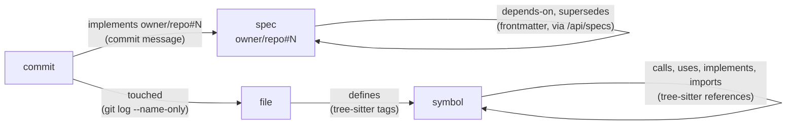

# context graph for agents

`mcp/` is a [model context protocol](https://modelcontextprotocol.io) server
that joins the board's specs with the code in a checkout. a coding agent asks
it for one thing at a time instead of loading the corpus or the tree.

## setup

it runs over stdio in the implementation repo. `.mcp.json` there:

```json
{
  "mcpServers": {
    "specdoc": {
      "command": "node",
      "args": ["/path/to/specdoc/mcp/server.js"],
      "env": { "SPECDOC_URL": "https://specs.josie.cloud" }
    }
  }
}
```

it reads the board's [read api](api.md) and the checkout's working tree and
`git log`. it writes nothing and holds no credential. knobs:
[configuration](configuration.md#specdoc-mcp).

the spec repos it reads are the ones the checkout's `implements owner/repo#N`
commits name, or `SPECDOC_NAMESPACE`. with neither it reads every namespace
the board serves.

## nodes and edges



| node | id | source |
|---|---|---|
| spec | `spec:owner/repo#N`; `spec:<shortid>` for an unnumbered note | `GET /api/specs`: title, status, abstract, `depends-on`, `supersedes`, PR number. body on demand from `GET /api/specs/<id>` |
| commit | `commit:<sha>` | `git log --grep='implements '` in the checkout. only commits naming a spec are nodes |
| file | `file:<path>` | `git ls-files`. any tracked regular file, parsed or not, since a config file or a doc can implement a spec |
| symbol | `sym:<path>#<name>`; `@<line>` when the file defines the name twice | tree-sitter over each parsed file: functions, methods, structs, enums, traits, modules, macros |

| edge | from | to | source |
|---|---|---|---|
| depends on, needed by | spec | spec | `depends-on:` in the frontmatter as the board resolves it. the inverse is computed locally |
| supersedes, superseded by | spec | spec | `supersedes:` in the frontmatter |
| implements | commit | spec | the `implements owner/repo#N` grammar, parsed by `spec-board/refs.js` so board and server agree. a bare `#N` resolves to the origin repo |
| touched | commit | file | the commit's file list |
| defines | file | symbol | the grammar's shipped `tags.scm` |
| references | symbol | symbol | the tags plus `mcp/queries/rust.scm`: calls, scoped paths, type positions, trait impls, imports. a reference inside a definition's body is an edge from that definition |

the chain is `spec -> commits -> files -> symbols`, walkable in both
directions. it is file-level: which symbols a commit changed is not recorded,
only which files. the `ponytail:` note in `mcp/trace.js` names hunk
intersection as the upgrade.

not in the graph: HedgeDoc revisions, comment threads, approvals, and any
note the board hides from guests. the spec side is what `/api/specs` serves.

the server stores nothing. it rebuilds the graph in memory from these sources
on each call, without a model in the loop.

## freshness

the index follows the working tree, so uncommitted edits are in it. each
tool call stats the tracked files and re-parses the ones whose modification
time moved. the implements-commits are re-read when `HEAD` moves. the spec
corpus is refetched when the board's `Cache-Control` lapses, which tracks its
poll interval; a board outage keeps the last corpus and says `stale:`. every
response starts with what it reflects:

```
index 3f2a9c1+dirty: 212 files, 1840 symbols; specs: 14 (netfyr/specs)
```

## tools

five tools. ids are what the tools print.
bare forms are guessed, so `src/dhcp.rs#refresh` and `netfyr/specs#7` work.

| tool | returns |
|---|---|
| `brief(max_tokens?)` | the spec index (approved and implemented listed, the rest counted) and the most referenced symbols with signatures, ranked by inbound references with a boost for files in the last twenty commits. about a thousand tokens |
| `search(query, kind?, level?, limit?)` | symbols by name (exact, prefix, substring) then by path fragment; specs by words in title or abstract. `level`: `fold` (one line), `preview` (plus signature or abstract), `full` (plus source) |
| `neighbors(id, direction?)` | one hop. symbol: callers, callees, the specs its file implements. spec: `depends-on`, dependents, `supersedes`, implementing commits and files. file: its symbols and the files that use them. commit: its specs and files |
| `get(id)` | a symbol's source, a file's outline, or a spec's published body with its implementing commits |
| `trace(id)` | spec to commits to files to symbols, or a symbol or file back to the specs its commits name |

every tool takes `max_tokens` (default `SPECDOC_MAX_TOKENS`, 1500; `brief`
defaults to `SPECDOC_BRIEF_TOKENS`, 1000). whole items past the budget are
dropped and the reply ends with how many and which argument narrows the
question. a symbol's source or a spec's body is cut line by line instead.
there is no two-hop query; [decisions](#decisions) has the reason.

## a session

implementing spec 7 in a checkout of `netfyr/netfyr`:

1. `brief` once.
2. `get spec:netfyr/specs#7` for the requirements and whatever already
   implements part of it.
3. `search dhcp`, then `neighbors sym:src/dhcp.rs#refresh` for callers,
   callees and the specs its file answers to.
4. edit; the next call sees the edit without a restart.
5. before committing, `trace file:src/dhcp.rs` shows which specs the file's
   history names, so the `implements netfyr/specs#7` trailer lands on the
   right commit and the change stays within that spec.

for a bug: `trace` on the file or symbol in the stack, `get` on the spec it
names, `neighbors` on that spec.

## without mcp

```sh
node /path/to/specdoc/mcp/server.js brief --out .specdoc/brief.md
```

writes the same brief for a `CLAUDE.md` to include with `@.specdoc/brief.md`.
`SPECDOC_BRIEF_TOKENS` sets the size. it goes stale like any generated file;
regenerate it from a git hook or let the tool do it. the spec side alone is
the [read api](api.md).

## languages

rust today. another language is its tree-sitter grammar package added to
`LANGS` in `mcp/index.js`, plus a `mcp/queries/<language>.scm` for what its
shipped `tags.scm` leaves out. for rust that file adds scoped calls, type
positions, trait method signatures and imports, which carry most cross-file
edges. symbol kinds are the grammar's node types minus their suffix; a new
grammar may need a case in `kindOf`.

## limits

- symbols match by name across the repo. a name defined in several places
  lists every candidate; the exact id carries `@<line>`.
- trace is file-level.
- `brief` ranks by reference count, not pagerank. the `ponytail:` note in
  `mcp/index.js` names the upgrade.
- no embeddings. search is by name, path, and words in a spec's title or
  abstract.
- one server per checkout and one board per server.

## decisions

each decision rests on a published measurement. revisit it when a newer one
contradicts it.

| decision | evidence |
|---|---|
| local process, not hosted | repograph, locagent and codexgraph all build from the checkout the agent edits, and none describes incremental updates. hosting would add a checkout, a volume and a lag to the board for no measured gain |
| one hop, budgeted | [repograph](https://proceedings.iclr.cc/paper_files/paper/2025/file/4a4a3c197deac042461c677219efd36c-Paper-Conference.pdf) table 4 (iclr 2025): a 1-hop neighbourhood of 2.3k tokens raised swe-bench lite resolve rate, a flattened 2-hop one of 10.5k tokens dropped it below no graph. codexgraph table 2 (naacl 2025): uncontrolled query output cost 22k to 102k tokens per task against 1.5k to 15k for plain retrieval |
| five typed tools, no MCP resources or query language | codexgraph's agent writes cypher through a translation model; without that layer its accuracy fell below the no-graph baseline. locagent's three typed tools with fold, preview and full detail are the model followed here |
| tree-sitter tags, no model-built graph | specs and commits are already structured. graphiti and cognee extract with a model per episode, so build cost scales with model throughput; their issue trackers are rate-limit reports. a regex extractor was tried and rejected: rust impl and method scoping breaks it |
| name search and an in-memory graph | nothing measured compares hybrid retrieval with plain traversal for this task, and name search has not come up short at this repo size. revisit if it does |
