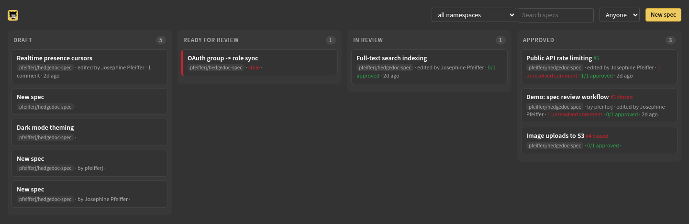
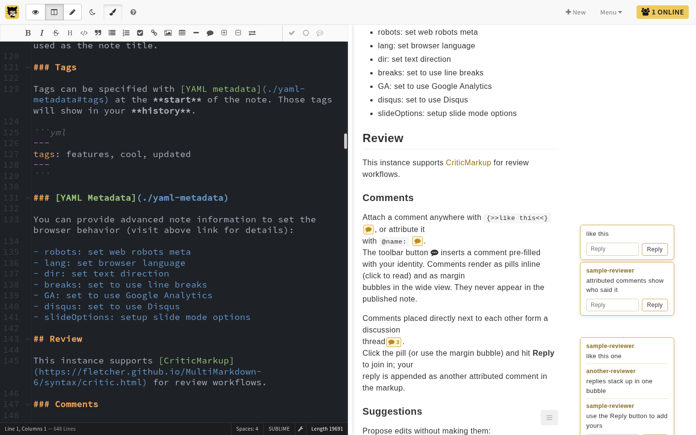

# spec lifecycle

a note is a spec when its frontmatter tags include `spec` plus a status tag.
the most advanced status tag wins; no status tag means draft.

```yaml
---
title: Realtime presence cursors
tags: [spec, draft]
owner: octocat
namespace: owner/repo
---
```

## creating a spec

the board's "new spec" button (with a namespace picker when more than one
repo is onboarded) opens the editor with the template: `spec` and `draft`
tags set, `owner` prefilled with your github login, `namespace` from the
picker or the default.

## statuses

| status | meaning | how it's reached |
|---|---|---|
| `draft` | being written | default for any spec note |
| `ready-for-review` | author considers it reviewable | "mark ready for review" in the editor navbar, or edit the tag |
| `in-review` | review underway | automatic once the first comment thread appears (computed by the board; resolving every thread reverts it), or "start review" |
| `approved` | quorum met, threads resolved | the approval that meets quorum flips the tag |
| `implemented` | implementing commit merged | an `implements` commit is detected; the card leaves the board |

cards in the review columns get a stale marker after `STALE_DAYS` (default
14) without changes.



## review

reviewers work inside the note with criticmarkup; the toolbar covers all of
it, nobody needs to learn the syntax:



- comments: `{>>@name: text<<}`, shown as margin bubbles and inline pills.
  adjacent comments form a thread; the reply box appends to it.
- suggestions: insert, delete, and replace spans with accept/reject buttons.
- resolving a thread means accepting or deleting its markup. unresolved
  threads show on the card and block approval.

approvers from the namespace's `.specs/roles.yml` get an approvals dropdown
in the navbar: the full roster with each approver's state. approve shows
while the spec is `ready-for-review` or `in-review`; approvals land in the
note's `approved-by` list and can be retracted.

## what approval triggers

once the `approved` tag is set, quorum is met, and no thread remains open,
the board (within one poll interval):

- locks the note via hedgedoc's `locked` permission: everyone reads, only
  the owner edits. one-shot; an owner who deliberately unlocks later isn't
  re-locked.
- opens the spec PR: `specs/NNN-slug/spec.md` (or
  `specs/<category>/NNN-slug/spec.md` on a category match), criticmarkup
  resolved to its accepted form, frontmatter stripped, first paragraph as
  the PR abstract. authored with the spec owner's github token; falls back
  to the service token, and the PR body says so.
- the PR number becomes the spec's reference number.

the spec commit carries gerrit-style trailers, so `git log` records the
review in the target repo:

```
spec: add 013 New approach

Spec-Id: rBk2DfsJR52onFFi8X5u-A
Reviewed-on: https://<editor-host>/rBk2DfsJR52onFFi8X5u-A
Reviewed-by: @alice
Reviewed-by: @bob
```

`Spec-Id` is the note's stable id, `Reviewed-on` links back to the note, and
`Reviewed-by` is emitted per approver who signed off (only `roles.yml`
approvers, never the note-editable `approved-by` alone). a `Supersedes:`
trailer is added when the spec replaces another.

an `approved` tag without quorum or with open threads gets the PR withheld
(logged by the poller); the tag alone is never enough on a governed repo.

## implemented

the spec completes when a commit referencing it merges to the default branch
of one of the namespace's implementation repos:

```
feat: presence cursors

implements #12
```

use `implements owner/spec-repo#12` from a different repo. the board marks
the spec implemented, sends a notification, and drops the card while keeping
its state.

## superseding a spec

when a spec needs replacing rather than editing, start a replacement: any
card with a PR carries a `replace` link (`show implemented` reveals shipped
specs so those are replaceable too). it opens a new spec in the same
namespace with `supersedes` prefilled:

```yaml
supersedes: 12          # a spec number in this namespace
# supersedes: owner/repo#12   # or one in another namespace
```

the replacement is an ordinary spec and goes through its own review. nothing
happens to the old spec until the replacement's PR opens, so an abandoned
replacement never retires a live spec. once approved:

- the old spec drops off the board (state kept, like an implemented spec).
- the old `spec.md` gets a "superseded by #M" banner, committed on the
  replacement's branch so it rides in the same PR (same-repo, once the old
  spec has merged; cross-repo or not-yet-merged targets are left to the
  webhook).
- the replacement commit records a `Supersedes: owner/repo#N` trailer, and
  the board posts the supersede on the webhook.

use a bare number for a same-namespace target: yaml reads an unquoted
leading `#` as a comment, so `supersedes: #12` silently drops the value.

## notifications

with a webhook configured, the board posts on: status moves, new comments
during review, approvals, the post-approval lock, PR opened, supersede, and
implementation.
